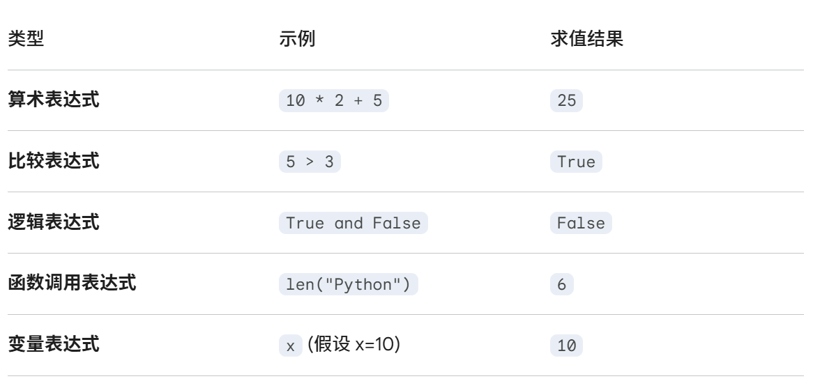

# Python 的基础
*对Python的语法基础进行分析*

---

## 2 语句与表达式

### 2.1 表达式 vs 语句 (Expression vs Statement)
!!!
    这是初学者最容易混淆的一对概念：**表达式 (Expression)：** 它是 “结果导向” 的。它就像一个计算题，总会给你一个答案。语句 (Statement)：它是“动作导向”的。它是在命令计算机执行某个任务。

```py
3 #这是一个表达式，有具体的结果

a=1 #而这是一个语句，它没有返回值 

```
### 2.2 表达式的类型




### 2.3 语句的类型

在 Python 中，语句主要分为两大类：**简单语句**和**复合语句**。

#### A. 简单语句 (Simple Statements)
这类语句通常只有一行。

* **赋值语句**：给变量起名并存入值。
    * `x = 5`
* **表达式语句**：虽然表达式本身不是语句，**但单独放一行时，它被视为语句。**  
    * `print("Hello")` （调用函数其实是一个有返回值的表达式，哪怕是None）
* **导入语句**：引入外部工具箱。
    * `import math`
* **跳转语句**：改变循环或函数的流向。
    * `break` / `continue` / `return` / `pass`
* **删除语句**：删除引用。
    * `del x`

#### B. 复合语句 (Compound Statements)
这类语句通常包含一个“头部”和缩进的“代码块（Body）”，用于控制复杂的逻辑。

* **条件分支语句**：做决定。
    * `if` / `elif` / `else`
* **循环语句**：重复干活。
    * `for ... in ...` / `while`
* **异常处理语句**：处理报错。
    * `try` / `except` / `finally`
* **定义语句**：创建函数或类。
    * `def` / `class`
* **上下文管理语句**：自动管理资源（如打开文件）。
    * `with`


## 3 输入输出函数

### 3.1 input函数

!!! warning
    无论你在键盘上打什么，都会被认为是文本string

#### 3.1.1 函数介绍

**A.什么时候停止**  
当按下回车时停止，即Enter键  

**B.返回值**  
input的返回值永远是一个字符串，可以包括空格，自动删除末尾的回车（即\n是没有的）

!!!
    在 Python 中，\0 可以放在任何位置，且字符串的结尾是没有\0的  

```py
s = "Hello\0World"  
print(len(s))    # 输出 11，它把 \0 当成一个字符计入了  
print(s)         # 输出 Hello World (中间有个看不见的空字符)
```


#### 3.1.2 函数调用

- A. 最基础的调用（获取字符串）
这是最原始的状态，无论你输入什么，Python 都会把它当成一串**文本**（字符串）。

```python
name = input("请输入你的姓名: ")
print(f"你好，{name}！")
```

- B. 结合 `int()`（获取整数）
因为 `input()` 默认返回字符串，如果你要进行数学运算，必须用 `int()` 强制转换。

```python
age = int(input("请输入你的年龄: "))
print(f"你明年就 {age + 1} 岁了。")
```

- C. 结合 `split()`（获取列表）
当你一行输入多个内容（比如用空格隔开）时，`split()` 会把这长长的一串拆分成一个**列表**。

```python
# 输入示例: 苹果 香蕉 橙子
fruits = input("请输入你喜欢的水果（用空格隔开）: ").split()
print(f"你一共输入了 {len(fruits)} 种水果。")
```

- D. 结合 `map()`（批量转换类型）
这是最进阶且高效的写法，通常用于一行读取多个数字并直接进行类型转换。

```python
# 输入示例: 10 20
# map 会对 split 拆出来的每一个元素都执行一次 int()
a, b = map(int, input("请输入两个数字并用空格隔开: ").split())
print(f"这两个数字的和是: {a + b}")
```


## 3.2 print 函数


!!! info
    `print()` 的作用是将对象输出到控制台（标准输出流）。与 `input()` 自动删除换行符相反，`print()` 默认会在末尾自动添加一个换行符 `\n`。  
    并且，也一定是文本！！！

### 3.2.1 函数介绍

`print()` 的完整函数签名如下：  
`print(*objects, sep=' ', end='\n', file=sys.stdout, flush=False)`

**A. `*objects` (输出对象)** * **含义**：表示可以一次性打印**任意数量**的对象。
* **特性**：各个对象之间用逗号 `,` 隔开，打印前会自动调用 `str()` 将对象转为字符串。
```py
print("Apple", 100, [1, 2, 3])  # 同时打印三个不同类型的对象
```

**B. `sep` (分隔符)** * **默认值**：一个空格 `' '`。
* **功能**：定义多个对象被打印时，中间用什么字符连接。
```py
print("2026", "04", "15", sep="-")  # 输出: 2026-04-15
```

**C. `end` (结束符)** * **默认值**：换行符 `'\n'`。
* **功能**：定义内容打印完毕后，最后追加的字符。若想连续输出不换行，可设为空字符串。
```py
print("Hello", end=" ")
print("World")  # 输出: Hello World (在同一行)
```

**D. `file` (输出目标)** * **默认值**：`sys.stdout` (屏幕)。
* **功能**：指定内容输出到哪里，通常用于将结果直接写入文件。
```py
with open("log.txt", "w") as f:
    print("这条信息存入文件", file=f)
```

**E. `flush` (强制刷新)** * **默认值**：`False`。
* **功能**：是否立即清空缓冲区并将内容推送到屏幕。在制作动态进度条时，通常设为 `True` 以确保实时显示。


### 3.2.2 函数调用（字符串格式化输出）

这是 `print` 最核心的用法，用于将变量优雅地嵌入文本。

#### A. f-string 格式化（推荐）
在字符串前加 `f`，在 `{}` 内直接写变量名或表达式。**语法最简洁，性能最高。**
```py
name = "Python"
version = 3.12
print(f"欢迎来到 {name.upper()} {version} 的世界！")
```

#### B. `format()` 方法
通过 `{}` 占位，在末尾使用 `.format()` 传入变量。适用于复杂的参数复用。
```py
# 1. 按照索引顺序填充
print("{0} 爱 {1}，{1} 也爱 {0}".format("猫", "鱼"))

# 2. 按照关键字填充
print("坐标: {x}, {y}".format(x=10, y=20))
```

#### C. `%` 占位符（旧式格式化）
类似于 C 语言，使用 `%` 连接字符串与变量。
```py
# %s 字符串, %d 整数, %f 浮点数
print("进度: %d%%" % 50)  # 输出: 进度: 50%
```


### 3.2.3 格式控制代码（进阶）

在 f-string 或 `format()` 的 `{}` 内部，可以使用 `:[格式]` 来精确控制显示。

| 功能 | 语法示例 | 说明 |
| :--- | :--- | :--- |
| **保留小数** | `f"{3.14159:.2f}"` | 保留 2 位小数，输出 `3.14` |
| **对齐宽度** | `f"{'Hi':>5}"` | 右对齐，总宽度 5，左侧补空格 |
| **居中填充** | `f"{'Hi':*^6}"` | 居中对齐，总宽度 6，两边填 `*` |
| **千分位** | `f"{1000000:,}"` | 输出 `1,000,000` |
| **二进制转换** | `f"{10:b}"` | 输出二进制 `1010` |
| **十六进制转换** | `f"{255:x}"` | 输出十六进制 `ff` |

**代码演示：**
```python
price = 12.5
count = 3
total = price * count

# 结合对齐与精度：宽度10，左对齐，保留2位小数
print(f"总价为: {total:<10.2f} 元") 
```


### 3.2.4 缓冲区说明

!!! tip
    默认情况下，`print` 会先将内容放入缓冲区以提高效率。如果你发现代码在运行但屏幕没反应（例如在密集循环中），可以尝试设置 `flush=True` 强制输出。

```python
import time
for i in range(5):
    print("#", end="", flush=True)  # 每隔 0.5 秒蹦出一个 #
    time.sleep(0.5)
```


!!! warning
    ### 注意事项

1. 在 Python 中，变量必须先进行赋值（Creation and Assignment）才能使用，赋值就是创建。如果尝试直接使用一个从未被赋值的变量，Python 会抛出 NameError。
