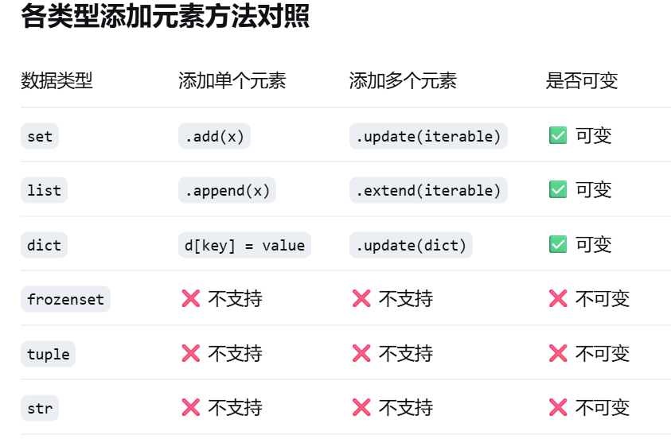

# 序列

---


## 1. 序列的分类

在 Python 中，序列是一种支持索引（Indexing）、切片（Slicing）和迭代的基础数据结构。根据创建后能否修改，分为以下两大类：

### 1.1 不可变序列 (Immutable Sequences)

这类对象一旦创建，其内部状态（元素及其顺序）便无法更改。尝试修改会触发 `TypeError`。

* **`str` (字符串)**：Unicode 字符序列。
* **`tuple` (元组)**：可以包含任意类型的通用不可变序列。
* **`range` (范围)**：高效的整数序列生成器（如你之前所述）。
* **`bytes` (字节序列)**：8 位字节的不可变序列，常用于处理二进制数据或网络传输。

!!! info "底层逻辑：哈希值（Hashability）"
    不可变序列（且其包含的元素也必须不可变）通常是 **可哈希的 (Hashable)**。这意味着它们可以作为 `dict` 的键（Key）或 `set` 的元素。

### 1.2 可变序列 (Mutable Sequences)

这类对象允许原位（In-place）修改，无需创建新对象即可更改内容。

* **`list` (列表)**：Python 中最灵活、最常用的可变序列。
* **`bytearray` (字节数组)**：`bytes` 的可变版本，支持在不重新分配内存的情况下修改单个字节。


## 2. 序列的操作 (Operations)

### 2.1 通用操作
所有序列类型（`list`, `tuple`, `str`, `bytes`）共有的运算符操作，注意range!


| 运算符 | 描述 | 逻辑说明 | 复杂度 |
| :--- | :--- | :--- | :--- |
| `x in S` | 成员检查 | 如果 $x$ 在序列 $S$ 中则为 `True` | $O(n)$ (range除外) |
| `x not in S` | 成员检查 | 如果 $x$ 不在序列 $S$ 中则为 `True` | $O(n)$ |
| `S[i]` | 索引访问 | 获取下标为 $i$ 的元素（支持负索引） | $O(1)$ |
| `S[i:j:k]` | 切片 | 提取从 $i$ 到 $j-1$ 步长为 $k$ 的子序列 | $O(k)$ |
| `S1 + S2` | 序列拼接 | 连接两个**同类型**序列并产生新对象 | $O(n+m)$ |
| `S * n` | 序列重复 | 将序列 $S$ 重复 $n$ 次并产生新对象 | $O(nm)$ |



!!! warning "range 的特殊性"
    `range` 类型**不支持** `+` (拼接) 和 `*` (重复) 操作。这是为了维持其 $O(1)$ 的恒定内存占用特征。

### 2.2 可变类型 (Mutable Operations)
仅适用于 `list` 和 `bytearray`。

* **索引赋值**：`L[i] = v` —— 原地替换指定位置元素。
* **切片赋值**：`L[i:j] = iterable` —— 将切片区域替换为可迭代对象中的元素。长度不一定要相等。
* **元素删除**：`del L[i]` 或 `del L[i:j]` —— 从内存中移除指定元素或片段。
* **增量赋值**：`L += iterable` —— 底层调用 `__iadd__`，效果等同于 `L.extend()`，地址不变。

### 2.3 不可变类型 (Immutable Operations)
主要涉及 `str`, `tuple`, `bytes`。

* **禁止赋值**：任何 `S[i] = v` 操作都会抛出 `TypeError`。
* **写拷贝 (Copy-on-write) 逻辑**：虽然支持 `S += S2`，但在底层是先计算 `S + S2` 产生新内存块，再将变量名重指向。在 $10^5$ 量级的循环中，这种操作会导致严重的性能瓶颈。

### 2.4 range
* **限制性序列**：仅支持“只读”类的通用操作（索引、切片、`in`）。
* **内存视图**：`range` 的切片操作 `R[i:j:k]` 返回的依然是一个 `range` 对象，而非计算后的列表。


## 3. 序列的方法 (Methods)

### 3.1 通用方法
所有序列均实现的查询接口。

* **`S.index(x[, start[, stop]])`**：返回 $x$ 第一次出现的索引。若不存在抛出 `ValueError`。
* **`S.count(x)`**：统计 $x$ 在序列中出现的总次数。

### 3.2 list类型 (In-place Methods)
此类方法直接修改对象内存，返回值均为 `None`。

| 方法 | 功能 | 复杂度 |
| :--- | :--- | :--- |
| `.append(x)` | 在末尾添加单个整体元素 | 摊销 $O(1)$ |
| `.extend(m)` | 将可迭代对象 $m$ 的内容全部追加到末尾 | $O(len(m))$ |
| `.insert(i, x)` | 在索引 $i$ 处插入 $x$ | $O(n)$ |
| `.pop([i])` | 移除并返回索引 $i$ 处的元素（默认末尾） | 末尾 $O(1)$ / 中间 $O(n)$ |
| `.remove(x)` | 移除序列中第一个值为 $x$ 的元素 | $O(n)$ |
| `.clear()` | 移除序列所有元素 | $O(n)$ |
| `.sort(...)` | 原地排序（Timsort 算法） | $O(n \log n)$ |
| `.reverse()` | 原地翻转 | $O(n)$ |


### 3.3 不可变类型
* **Tuple**：由于不可变，仅支持 `.index()` 和 `.count()`。
* **String**：虽然拥有丰富的 `.replace()`, `.upper()`, `.join()` 等方法，但它们**全部返回新字符串**，不属于原地修改。

### 3.4 range
* **数学驱动**：`range` 的 `.index()` 和 `.count()` 被高度优化。
* **复杂度 $O(1)$**：它通过公式 $start + n \times step$ 直接计算是否存在某个值，而不需要像 `list` 那样遍历整个序列。


## 4. 序列的函数 (Functions)

### 4.1 通用函数
Python 内置的全局工具。

* **`len(S)`**：返回长度。对于内置序列是 $O(1)$（直接读取属性）。
* **`max(S)` / `min(S)`**：返回最值。要求元素间类型兼容。
* **`sum(S[, start])`**：求和。仅适用于数值序列。
* **`sorted(iterable, ...)`**：**构造新列表**并返回排序结果。
* **`reversed(S)`**：返回一个**反向迭代器**，不占用额外内存块。
* **`enumerate(S)`**：生成 `(index, item)` 的枚举对象。
* **`zip(*iterables)`**：将多个序列打包成元组对。

### 4.2 可变类型相关
* **`list(iterable)`**：将任何序列（如 `range` 或 `tuple`）显式转换为可变列表。
* **`copy.copy()` / `copy.deepcopy()`**：对于包含嵌套列表的复杂序列，必须使用深拷贝以防止引用污染。

### 4.3 不可变类型相关
* **`tuple(iterable)`**：常用于将 `list` 冻结为不可变状态，以作为字典键。
* **`hash(S)`**：**关键点**。仅不可变序列（且元素亦不可变）支持哈希运算。

### 4.4 range
* **`range(start, stop, step)`**：构造函数。
!!! info "参数限制"
    `range` 的所有参数必须是**整数 (int)**。传入浮点数将引发 `TypeError`。


## 5. 核心机制补充

### 5.1 复合对象的“假不可变性”
这是一个经典的面试坑点，也是理解 Python 引用机制的关键。

!!! warning "注意：元组的不可变是相对的"
    `tuple` 只能保证其持有的**引用（Reference）**不发生改变。如果元组内部嵌套了一个可变对象（如列表），那么这个列表的内容是可以被修改的。
    ```python
    t = (1, 2, [3, 4])
    # t[2] = [5, 6]  # 报错：TypeError (不可修改引用)
    t[2].append(5)   # 成功：(1, 2, [3, 4, 5]) (修改了引用指向的对象内容)
    ```

### 5.2 序列的内存分配策略
* **List 的动态扩容**：`list` 并非按需分配，而是采用“超额分配”策略（Over-allocation），以保证 `append` 操作的摊销时间复杂度为 $O(1)$。
* **String Interning (字符串驻留)**：对于短小的字符串，Python 会尝试在内存中只保留一份副本，以节省空间并加速比较运算。

### 5.3 切片操作的开销
!!! info "性能提醒"
    对于大部分序列（如 `list`, `tuple`, `str`），切片操作 `a[start:stop]` 会创建一个**新的副本**，时间复杂度为 $O(k)$（k 为切片长度）。
    若处理超大型二进制数据且不希望拷贝内存，建议研究 `memoryview` 类型。


### 5.4 序列类型深度对比

#### 1. List (列表) —— 灵活的“动态阵列”
* **本质**：一个存储**对象引用（指针）**的变长数组。
* **特性**：可变（Mutable）。当你修改列表时，Python 会在原内存地址上操作。
* **新手理解**：它就像一个能无限扩容的快递柜。
    ```python
    a = [1, 2]
    print(id(a))
    a.append(3)
    print(id(a))  # id 不变，说明是在“原地”加东西
    ```

#### 2. Tuple (元组) —— 稳固的“常量阵列”
* **本质**：一旦创建，其内部的指针数组就不能再指向其他地方。
* **特性**：不可变（Immutable）。比列表更轻量、更安全。
* **优势**：因为长度固定，Python 内部做了优化，遍历和创建的速度通常比 `list` 快一些。
    ```python
    t = (1, 2, 3)
    # 常用于函数返回多个值，或者作为字典的键（List 不行）
    ```

#### 3. Range (范围) —— 聪明的“虚拟序列”
* **本质**：它并不在内存里存下所有的数字，而只是记录了 `start`, `stop`, `step` 三个值。
* **特性**：**极度节省内存**。无论 `range(10)` 还是 `range(1000000)`，占用的内存空间是一样大的。
* **注意**：它是不可变的，且只能包含整数。
    ```python
    r = range(0, 100, 2)
    print(10 in r)  # True (计算出来的，不是存出来的)
    ```

#### 4. Str (字符串) —— 纯粹的“字符序列”
* **本质**：Unicode 字符的不可变序列。
* **特性**：不可变。任何对字符串的修改（如 `.upper()`, `.replace()`）都会**产生一个全新的字符串**对象。
* **新手坑**：频繁拼接字符串建议用 `"".join(list)`，因为用 `+` 号会产生大量中间垃圾对象。

#### 5. Bytes / Bytearray —— 底层的“字节流”
* **Bytes**：不可变，用于处理二进制数据（如图片、视频、网络报文）。
* **Bytearray**：**可变**版本的字节序列，支持原地的修改操作。
    ```python
    # 在处理文件写入、网络数据包时非常有用
    b = bytearray(b"Hello")
    b[0] = ord("h")  # 原地修改为 "hello"
    ```

### 5.5 总结对比表

| 类型 | 可变性 | 存储内容 | 典型场景 |
| :--- | :--- | :--- | :--- |
| **List** | 可变 | 任意对象引用 | 数据收集、动态修改 |
| **Tuple** | 不可变 | 任意对象引用 | 结构化记录、字典键、安全保护 |
| **Range** | 不可变 | 整数规律 | 循环控制、节省内存的计数 |
| **Str** | 不可变 | Unicode 字符 | 文本处理 |
| **Bytes** | 不可变 | 0-255 的字节 | 二进制文件、网络传输 |
| **Bytearray** | **可变** | 0-255 的字节 | 需要频繁修改的二进制缓冲区 |


## **运算符链接（Comparison Chaining）** 
是 Python 中一项非常人性化的特性，它允许我们将多个比较运算符写在同一个表达式中，而不需要显式地使用 `and` 逻辑运算符。

这种语法在处理**区间判断**（如判断一个数是否在 0 到 100 之间）时非常直观，其核心逻辑是将数学上的连续不等式直接映射到代码中。

---

### 1. 核心机制：等价转换
在 Python 中，表达式 $a < b < c$ 并不像其他语言（如 C 或 Java）那样先计算 `a < b` 得到一个布尔值。

Python 会将其自动展开为：
$$(a < b) \text{ and } (b < c)$$

**关键点：** 中间的操作数 $b$ 只会被**计算一次**（即使 $b$ 是一个复杂的函数调用），这在保证效率的同时也避免了副作用。


---

### 2. 支持的运算符
不仅仅是小于号，所有的**比较运算符**（Comparison operators）都可以参与链接：

* **大小比较：** `<`, `>`, `<=`, `>=`
* **相等比较：** `==`, `!=`
* **身份与成员：** `is`, `is not`, `in`, `not in`

#### 示例代码：
```python
# 1. 经典的区间判断
x = 5
print(0 < x <= 10)  # 等价于 (0 < 5) and (5 <= 10) -> True

# 2. 混合运算符
print(a == b < c)    # 等价于 (a == b) and (b < c)

# 3. 成员与身份链接
print(obj is not None in cache) # 等价于 (obj is not None) and (None in cache)
```

---

### 3. 短路逻辑（Short-circuiting）
链接比较遵循 `and` 的短路原则。如果左侧的比较已经失败，右侧的部分将**完全不会执行**。

```python
def expensive_func():
    print("执行了复杂的计算！")
    return 10

# 如果第一个比较失败，后面的 expensive_func() 不会被调用
print(1 > 5 < expensive_func()) 
# 输出结果直接为 False，且不会打印“执行了复杂的计算！”
```

---

### 4. 为什么会出现坑？
正如你之前看到的 `"34" in "1234" == True`，问题在于**优先级一致**。

当你把 `in` 和 `==` 放在一起时，Python 会把它们看作平级的比较符进行链接，而不是按照你想象中的顺序执行：
* **直觉：** `("34" in "1234") == True` $\rightarrow$ `True == True` $\rightarrow$ `True`
* **解析：** `("34" in "1234") and ("1234" == True)` $\rightarrow$ `True and False` $\rightarrow$ `False`

---

### 总结
| 特性 | 说明 |
| :--- | :--- |
| **可读性** | 让代码更接近数学表达，如 $18 \le age < 35$。 |
| **效率** | 中间变量只计算一次，且支持短路。 |
| **陷阱** | 混合使用不同类型的运算符（如 `in` 和 `==`）时，容易产生逻辑误解。 |

这种设计体现了 Python "Readable code is better code" 的哲学。


