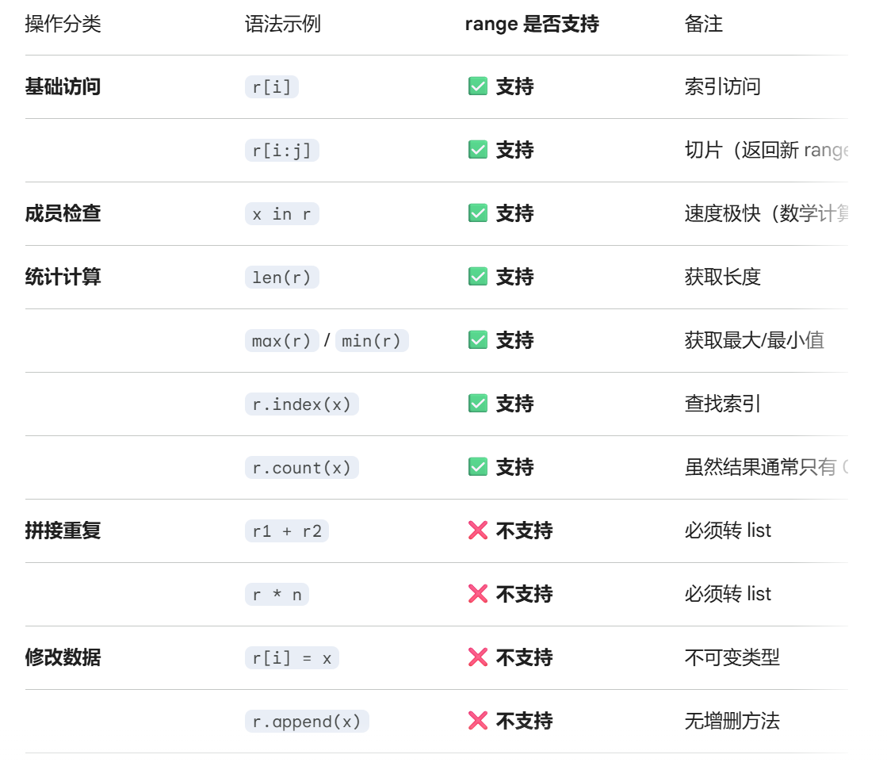
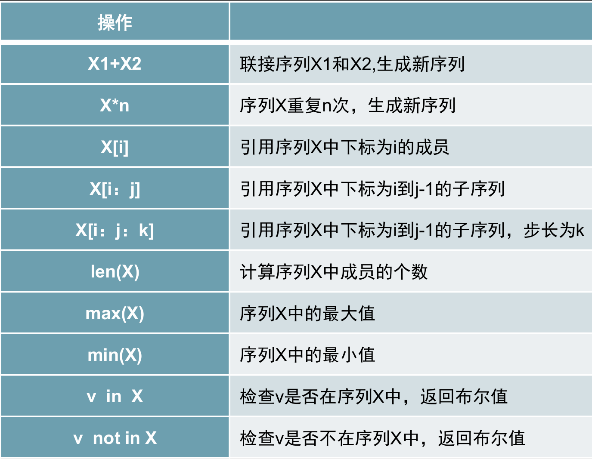

# range 类型

*称为"整数序列生成器"或 简称为"范围"*

---

## 1 range 的定义

`range` 是 Python 的内置类型，用于表示一个**不可变的整数序列**。

!!! info
    在 Python 3 中，`range` 是一个专门的类型（<class 'range'>），而不仅仅是一个函数。它最常用于在 `for` 循环中指定循环次数。

### 1.1 核心特性

* **惰性求值（Lazy Evaluation）**：它不会在内存中预先创建整个数字列表，而是只存储起始、终止和步长。只有在迭代时才会实时计算下一个数值。
* **内存效率高**：无论 `range` 表示的范围是 10 还是 100 万，它占用的内存空间都是固定且极小的。
* **不可变性**：一旦创建，不能修改其内部参数，也不能像列表那样对某个索引进行赋值。


## 2 语法与参数

`range` 接受 1 到 3 个参数，语法如下：

### 2.1 语法格式
* `range(stop)`
* `range(start, stop[, step])`

### 2.2 参数详解
!!! warning 
    参数必须是整数int类型，错误时返回空的range，仍然保留有range的特征

| 参数 | 含义 | 默认值 | 说明 |
| :--- | :--- | :--- | :--- |
| **`start`** | 序列开始的值 | `0` | 包含该值（左闭） |
| **`stop`** | 序列结束的值 | **必填** | **不包含**该值（右开） |
| **`step`** | 步长 / 间隔 | `1` | 每次递增的数值；可以为负数 |

**示例**
```py
# 1. 只有一个参数：从 0 开始，到 5 结束（不含 5）
print(list(range(5)))  # [0, 1, 2, 3, 4]

# 2. 两个参数：从 2 开始，到 6 结束（不含 6）
print(list(range(2, 6)))  # [2, 3, 4, 5]

# 3. 三个参数：从 1 开始，到 10 结束，步长为 2
print(list(range(1, 10, 2)))  # [1, 3, 5, 7, 9]

# 4. 负数步长：递减序列
print(list(range(10, 0, -2)))  # [10, 8, 6, 4, 2]


# 生成 -1, -3, -5
print(list(range(-1, -6, -2)))

```


## 3 range 的高级操作

虽然 `range` 不是列表，但它是一个**序列**，因此支持许多类似列表的只读操作。

!!!warning
    range是不可变序列类型，不支持修改数据和拼接重复

**具体内容可以参考下表：**



**附表：** 序列常用操作




## 4 常见应用场景

### 4.1 for 循环控制
这是 `range` 最主要的使用方式。
```py
# 循环执行 3 次
for i in range(3):
    print("第", i+1, "次执行")
```

### 4.2 配合索引遍历列表
当既需要元素又需要索引时使用。
```py
fruits = ["apple", "banana", "cherry"]
for i in range(len(fruits)):
    print(f"索引 {i} 对应的是 {fruits[i]}")
```

### 4.3 快速生成数字列表
利用 `list()` 函数将 `range` 对象转换为实体列表。
```py
nums = list(range(1, 101)) # 快速生成 1 到 100 的列表
```


## 5 range vs list对比

| 特性 | `range` 对象 | `list` 列表 |
| :--- | :--- | :--- |
| **存储内容** | 仅存储 start, stop, step | 存储每一个具体的元素 |
| **内存占用** | **极小且恒定** (O(1)) | 随元素数量增加而增大 (O(n)) |
| **可变性** | 不可变 (Immutable) | 可变 (Mutable) |
| **性能** | 迭代速度快，初始化极快 | 频繁增删元素效率低 |
| **数据类型** | 只能包含整数 | 可以包含任何类型 |


## 注意事项

1.  **右开区间**：`range(0, 10)` 永远不会包含 `10`。
2.  **空序列**：如果 `start` 大于 `stop` 且 `step` 为正数，或者 `start` 小于 `stop` 且 `step` 为负数，`range` 会产生一个空序列，且不会报错。
    * `range(5, 2)` -> 空
    * `range(2, 5, -1)` -> 空
3.  **类型限制**：`range` 的参数必须是**整数**。传递浮点数（如 `range(0, 0.5)`）会抛出 `TypeError`。
4.  **直接打印**：直接 `print(range(10))` 会输出 `range(0, 10)` 而不是数字列表。若要查看内容，需使用 `list(range(10))`。


