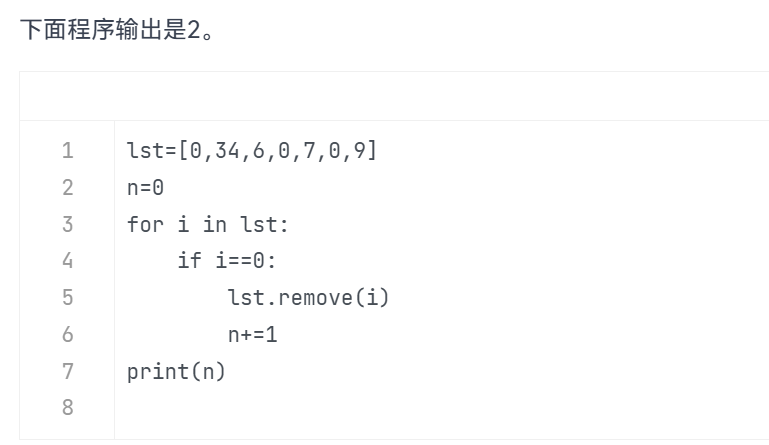
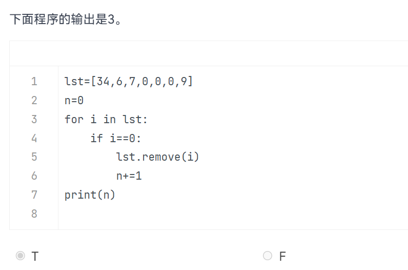

# 序列的补充内容

---

## 1 在遍历时改变列表

这正是整个问题的核心！要彻底理解 `i` 是怎么走的，我们需要揭开 Python `for` 循环底层的“小秘密”。

在 Python 中，当你写 `for i in lst:` 时，底层其实有一个**隐形的指针（计数器）**。这个指针非常死板，它的逻辑只有一条：**从索引 `0` 开始，每循环完一次，索引就雷打不动地 `+1**`。

它根本不知道、也不关心你在循环体里对列表做了什么修改。

修改列表通常有两种情况：**删除元素**和**添加元素**。它们的后果截然不同：


## 情况一：遍历时“删除”元素 ── 导致【漏检】

当你在当前位置删除了一个元素，后面的所有元素都会**整体向左移动（前移）一格**。但是指针依然会雷打不动地**向右移动（`+1`）**。这一左一右的错位，就会导致**紧跟在被删元素后面的那个元素被完美跳过**。

### 🎬 “i” 的走位现场还原：

假设列表是 `[A, B, C, D]`，指针当前指向 **索引 1**（也就是 `B`）：

* **第 1 步**：`i` 拿到了 `B`。
* **第 2 步**：你执行了 `remove(B)`。列表瞬间变成 `[A, C, D]`。原本在后面的 `C` 往前坐到了 **索引 1** 的位置。
* **第 3 步**：这轮循环结束，指针盲目地 `+1`，走向 **索引 2**。
* **第 4 步**：在新列表 `[A, C, D]` 中，索引 2 对应的元素是 `D`。

> 结果：`i` 下一次直接拿到了 `D`，而原本紧跟在后面的 `C`（由于前移到了索引 1）就被彻底漏掉了。


## 情况二：遍历时“添加”元素 ── 导致【重复】或【死循环】

如果你在遍历时往列表里加元素，后果取决于你加在哪里。

### 1. 使用 `insert()` 插在当前指针的前面或当前位置

这会导致后面的元素**整体向右移动（后移）一格**。由于指针下一轮依然是 `+1`，它会再次踩中刚才刚刚处理过的那个元素。

* **现场模拟**：列表 `[A, B, C]`，指针在索引 1（`B`）。你在索引 1 强行插入一个 `X`。
* 列表变成：`[A, X, B, C]`。`B` 被挤到了索引 2。
* 下一轮指针走到索引 2，`i` 再次拿到了 `B`。**`B` 被处理了两次！**

### 2. 使用 `append()` 追加到列表末尾

这最危险。如果你在循环里满足某个条件就 `append()` 一个新元素，列表的长度就会一直增加。指针往后走的时候，总能发现后面还有新元素，这就极易引发**死循环**，直到电脑内存崩溃。

```python
# 这是一个典型的死循环作死示例（请勿轻易运行）：
lst = [1, 2]
for i in lst:
    lst.append(i)  # 每次指针往后走，列表都在变长，永远走不到头

```

## 💡 终极总结

在 Python 的 `for` 循环里，变量 `i` 本身并没有什么神奇的走位，它就像一个莫得感情的搬运工，每轮只负责去 `lst[当前索引]` 搬运数据。

* 如果你**删了**前面的东西，后面的东西滑过来，`i` 就会**漏掉**数据。
* 如果你**加了**前面的东西，后面的东西退回去，`i` 就会**重复**数据。

所以，Python 官方文档和所有资深程序员都会给你同一个铁律：**迭代一个列表的同时去修改它，行为是未定义的（不可预测的）。如果一定要改，请遍历它的复制件（如 `for i in lst[:]`）或者使用列表推导式。**

## 下面有两道判断题：都是F





## 2 元组的创建注意事项

!!! warning 
    **一定要加逗号！**
**这里以一道经典题目为例：**  

以下（ A ）操作会创建包含一个元素'abcd'的元组 tp。  
- A.tp =tuple(["abcd"])  
- B.tp =tuple("abcd")  
- C.tp =tuple(("abcd"))  
- D.tp =("abcd")  

**分析：**
* **A 选项**：用 `tuple()` 转换一个**单元素**列表，能成功创建出单元素元组（正确答案）。
* **B 选项**：直接对字符串使用 `tuple()`，它会被强行拆散成包含四个字符的元组。
* **C 选项**：内层括号因为没加逗号只是普通字符串，导致它和 B 选项一样被拆散。
* **D 选项**：单元素外面只加圆括号而**不加逗号**，Python 只会把它识别为普通的字符串。


