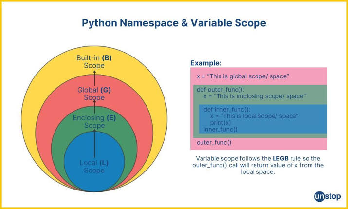

# 命名空间与变量生存期

*LEGB 解析链、作用域突变与动态绑定机制*

---

## 1 命名空间 (Namespace) 的底理解构

简单来说，**命名空间（Namespace）就是一张“名字到对象的映射表”**。在 CPython 的底层实现中，命名空间的本质就是一个标准的 **PyDictObject（字典对象）**。它的核心作用是实现符号隔离，彻底避免变量名冲突。

可以把它想象成操作系统中的**文件目录系统**：

> 如果在同一个文件夹里创建两个名为 `test.txt` 的文件，系统会触发命名冲突。但若分别在 `文件夹A` 和 `文件夹B` 内放置 `test.txt`，它们便能安全共存。这里的目录隔离，对应的就是独立的命名空间。


### 1.1 作用域寻址：LEGB 规则链

Python 的命名空间并不是扁平散落的，而是呈现出嵌套的“俄罗斯套娃”结构。当在代码中引用一个变量（符号）时，Python 解释器会严格按照由内向外的顺序在四个物理区间中进行线性检索：




#### LEGB 四大空间高密度映射表

| 层级标识 | 命名空间类型 | 作用域范围与生命周期 | 典型存储示例 | 检索优先级 |
| --- | --- | --- | --- | --- |
| **L** | **局部 (Local)** | 函数或生成器内部。在**函数被调用时**动态创建栈帧，函数执行完毕（`return` 或报错）时立即销毁。 | 函数体内部赋值的 `x = 10` | 最高 (层级 1) |
| **E** | **嵌套 (Enclosing)** | 外部嵌套函数的内部环境（常见于闭包结构）。伴随外部函数的闭包变量生命周期延伸。 | 内部闭包函数去读取外层函数的变量 | 次高 (层级 2) |
| **G** | **全局 (Global)** | 当前模块（即单个 `.py` 文件）的顶层空间。模块被解释器加载时创建，程序彻底结束时销毁。 | 在文件最外层定义的全局变量 | 次低 (层级 3) |
| **B** | **内置 (Built-in)** | Python 解释器官方自带的顶层命名空间。Python 进程启动时加载，进程退出时销毁。 | 系统内建函数如 `print`, `len`, `ValueError` | 最低 (层级 4) |

下面是一段代码展示

```python
x = "我是全局变量"  # 存在于 Global 全局命名空间

def my_func():
    x = "我是局部变量"  # 存在于 Local 局部命名空间
    print(x)          # 检索顺序：Local(命中) -> 打印出 "我是局部变量"

my_func()
print(x)              # 检索顺序：当前最外层属于 Global(命中) -> 打印出 "我是全局变量"

```

### 1.2 运行时符号自省

在实际开发中，可以通过 Python 内置的两个自省接口，直接将底层的命名空间字典打印出来进行观测：

* **`locals()`**：捕获并返回当前执行上下文的局部命名空间字典。
* **`globals()`**：捕获并返回当前模块的全局命名空间字典。


## 2 局部变量 vs 全局变量的控制流

局部变量与全局变量在空间边界、内存留存和可变性管理上存在本质差异。

### 2.1 突变修改隔离陷阱

!!! warning "作用域遮蔽（Scope Shadowing）与修改黑洞"
    在 Python 中，可以在函数内部直接**读取**全局变量。但如果尝试在内部对一个全局变量直接进行**赋值修改**，Python 编译器在编译期就会认为试图声明一个同名的局部变量，从而产生“作用域遮蔽”，破坏对外部变量的写操作。
* **规避方案**：若要修改全局空间符号，必须使用 `global` 关键字；若要修改外部嵌套闭包空间符号，必须使用 `nonlocal` 关键字。

```python
count = 10  # 全局变量 (Global)

def shadow_trap():
    # count = count + 1  # 错误：会触发 UnboundLocalError，因为赋值操作使 count 被误判为局部变量
    pass

def correct_modify():
    global count     # —— 正确：显式声明打通全局命名空间
    count = 20       # 成功修改全局变量

correct_modify()
print(count)  # 输出: 20

```

**典型例题1**

```py
def fun(lst=[1]):
     lst2=[2]
     lst.append(30)
     lst1.append(40)
     lst2.append(50)

lst1=[10]
lst2=[20]

fun(lst2)

print(lst1,lst2)
```


**典型例题2**

```py
def change1(L1=[]):
     L2=[]
     L1.append(3)
     L2.append(4)
     
L1=[1];L2=[2]
change1(L1=[1])

print(L1,L2)
```


## 3 静态变量 vs 动态变量的底层拟合

对于习惯了 C++ 或 Java 等静态强类型语言的开发者，Python 在这一层级的实现展现出了独特的“动态映射特性”。

### 3.1 静态变量的替身：类变量 (Class Variable)

Python 的设计哲学中**没有原生的 `static` 关键字**。如果在函数内部声明变量，它绝不可能像 C 语言的 `static int` 一样在函数调用结束后继续在栈帧外驻留。  

为了在多个实例或调用之间共享状态，Python 采用 **类属性/类变量** 作为静态变量的替代架构：

```python
class FleetVehicle:
    wheel_count = 4  # 相当于“静态变量”（类变量），存储于类空间的 __dict__ 中，全实例共享

    def __init__(self, vin):
        self.vin = vin  # 普通实例变量，独属于单个实例的堆内存空间

# 物理验证：无需实例化，通过类名直接寻址访问
print(FleetVehicle.wheel_count)  # 输出: 4

```

### 3.2 动态特征的两大维度

Python 变量天生具备极致的动态特征，主要体现在以下两个技术支柱：

* **类型动态化 (Dynamic Typing)**：变量仅仅是一个指针（引用），它本身没有任何类型约束，可以随时指向任何全新的内存对象。
* **属性动态拓扑 (Dynamic Attributes)**：运行期间，可以随时向对象、类甚至模块的 `__dict__` 中动态塞入、修改原本不存在的命名项。

```python
# 1. 类型动态演变
pointer = 0xff      # 初始绑定整型对象
pointer = "String"  # 运行时无缝改签字符串对象

# 2. 属性动态注入
class RuntimeContainer:
    pass

obj = RuntimeContainer()
obj.dynamic_payload = [1, 2, 3]  # 运行时动态为其字典注入新属性

```


## 4 变量类型综合对比矩阵

| 变量分类 | 声明语法边界 | 内存驻留期 | 跨作用域读写权限 | 核心底层机制 |
| --- | --- | --- | --- | --- |
| **局部变量** | 函数、生成器内部直接赋值 | 伴随对应函数栈帧（Stack Frame）的弹出而销毁 | 仅限本函数内；外部闭包通过 `nonlocal` 读写 | CPython 级别的 `fast locals` 静态数组优化 |
| **全局变量** | 模块最外层，或函数内 `global` 声明 | 从模块加载到进程结束 | 全局只读；函数内需 `global` 锁死方可写入 | 映射在当前模块对象的 `__dict__` 字典中 |
| **静态变量**<br>(类变量) | 独立于类体（Class Block）的直接赋值 | 伴随类生命周期持续驻留（通常直到程序结束） | 通过类名或实例指针均可共享读写 | 存放在 `Class.__dict__` 中，支持 MRO 继承链检索 |
| **动态变量** | Python 默认的任何变量指针 | 依赖 CPython 的引用计数与垃圾回收（GC）机制 | 自由类型转换，自由属性拓扑 | 变量名作为纯 Key 动态在不同字典间寻址路由 |


## 注意事项

1. **避免污染内置空间**：切勿覆盖如 `list`, `str`, `dict` 等 Built-in 空间的内建名称（例如写出 `list = [1, 2]`），这会导致在当前作用域下内建构造函数被完全遮蔽。
2. **闭包内的循环变量陷阱**：在嵌套空间（Enclosing）中，如果内部闭包引用了外部循环的迭代变量，闭包捕获的是该变量的**最新引用**而非当时的值。推荐通过默认参数（如 `lambda x, v=i: ...`）实现快照固化。
3. **`locals()` 字典的只读警告**：在函数体内部，`locals()` 返回的字典是当前栈帧 `fast locals` 的一个瞬时快照副本。**直接修改 `locals()` 字典的值，并不能同步去改变真实的局部变量。**
