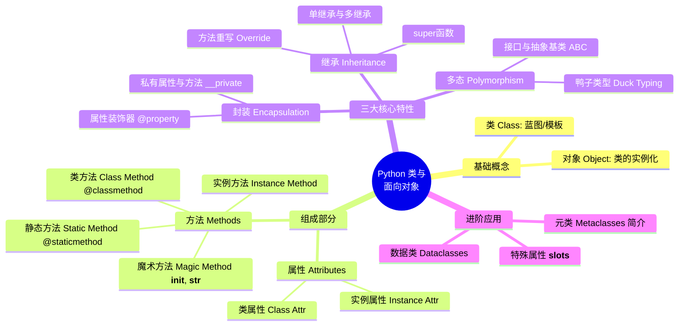

# 01. 面向对象与类 (Classes) 简介

在前面 `basic` 章节的学习中，我们接触了函数、数据类型、列表字典等基础概念，这种通过编写一步步的函数来解决问题的编程风格称为 **面向过程编程 (Procedural Programming)**。

而在这一章，我们将进入 Python 最重要的核心之一：**面向对象编程 (Object-Oriented Programming, 简称 OOP)**。

## 1. 什么是面向对象？

如果说面向过程是“**步骤化**”的思维（第一步做什么，第二步做什么），那么面向对象则是“**模型化**”的思维（将问题拆解为不同的实体）。

*   **类 (Class)**：就像是制造汽车的 **设计图纸**。它定义了这辆车应该有什么特征（颜色、品牌等属性）以及能做什么行为（启动、刹车等动作）。
*   **对象/实例 (Object/Instance)**：是根据设计图纸实际造出来的、真真实实的 **具体的汽车**。你可以造很多辆车，它们共用同一套设计图，但每辆车的具体颜色可以不同。

### 为什么需要类？
- **封装与复用**：把数据（变量）和操作数据的方法（函数）打包在一起，方便在不同地方重复使用，代码更易于维护。
- **更好地模拟现实世界**：现实中的事物（比如用户、订单、游戏里的敌人和武器）都有状态和行为，用类来描述它们非常自然。


## 2. Python 类的知识体系思维导图

在接下来的内容中，我们将逐步深入学习 Python 面向对象的核心概念。以下是本章节的内容规划和知识脉络思维导图：



*(注意：后续的内容我们将按照这个思维导图的结构，拆分成多篇文档为你逐步讲解。)*


## 3. 初识：一个最简单的例子

为了让你对类有一个直观的感受，我们先来看一个最基础的 Python 类的例子：

```python
# 定义一个“狗”类（Dog 是类名，按照规范通常首字母大写）
class Dog:
    
    # 这是一个特殊的方法，称为构造函数(初始化方法)。当你创建一只新狗时，会自动调用它
    def __init__(self, name, age):
        self.name = name  # 属性：名字
        self.age = age    # 属性：年龄
        
    # 这是一个普通的方法，定义了狗的行为
    def bark(self):
        print(f"{self.name} 汪汪叫！它今年 {self.age} 岁了。")

# ----------------------------

# 根据 Dog 类（图纸），实例化两只具体的狗（对象）
dog1 = Dog("旺财", 3)
dog2 = Dog("大黄", 5)

# 调用对象的属性与方法
print(dog1.name)     # 访问属性，输出: 旺财
dog1.bark()          # 调用方法，输出: 旺财 汪汪叫！它今年 3 岁了。

dog2.bark()          # 输出: 大黄 汪汪叫！它今年 5 岁了。
```

在这个例子中：
* `Dog` 就是**类 (Class)**。
* `dog1` 和 `dog2` 就是根据类创建出来的具体**对象 (Object)**。
* `name` 和 `age` 依附于对象存在，称为**属性 (Attribute)**。
* `bark()` 是对象可以执行的动作，称为**方法 (Method)**。


## 4. 与c语言对比

Python 和 C++ 虽然都支持面向对象编程（OOP），但由于设计哲学不同（Python 追求**动态与开发效率**，C++ 追求**静态与极致性能**），两者的“类”在底层机制和使用上有巨大的差异。

下面为你整理了一份详尽的、严谨的左右对比表，帮助你彻底理清两者的区别：

## Python 与 C++ 类（Class）全方位对比表

| 对比维度 | Python 中的类 (Class) | C++ 中的类 (Class) |
| --- | --- | --- |
| **设计核心哲学** | **动态性**。类和对象在运行时是可以完全被修改的。 | **静态性**。类的结构在编译期就已固化，运行时不可更改。 |
| **类型检查机制** | **动态类型/鸭子类型（Duck Typing）**。关注对象“能做什么”，而不是它“是什么”。 | **静态强类型**。严格检查对象的类型，通常需要通过继承来实现多态。 |
| **访问控制权限** | **基于命名规范（靠自觉）**：<br>• 公开：`name`<br>• 保护：`_name` (提示不要外部访问)<br>• 私有：`__name` (名字重整变相隐藏) | **基于关键字（编译器强制）**：<br>• `public`：任意访问<br>• `protected`：类及子类访问<br>• `private`：仅类内部访问 |
| **属性动态添加** | **支持**。可以在运行时随时给某个**实例**或**类**添加新的属性或方法。 | **不支持**。所有属性和方法必须在编译前的类定义中写死。 |
| **实例化与内存分配** | **全在堆（Heap）上**。实例化语法 `p = People()`，实际创建的是引用，由垃圾回收机制（GC）自动管理。 | **可堆可栈**：<br>• 栈分配：`People p;` (自动释放)<br>• 堆分配：`People* p = new People();` (需手动 `delete`) |
| **指针与引用** | 没有指针概念，**所有变量名本质上都是对象的引用（标签）**。 | 原生支持**指针（`*`）**和**引用（`&`）**，能直接操作内存地址。 |
| **`self` 与 `this`** | **显式传递**。类的方法定义时必须明确写出第一个参数（通常叫 `self`），代表实例本身。 | **隐式传递**。方法内部隐含一个 `this` 指针，指向当前对象，无需在参数列表中写出。 |
| **方法重载 (Overloading)** | **原生不支持**。同名方法写多个，后面的会覆盖前面的（需用可变参数 `*args` 或默认参数曲线救国）。 | **原生支持**。允许同名方法存在，只要参数列表（类型、个数）不同即可。 |
| **多继承与钻石问题** | **通过 MRO (C3 线性化算法)** 自动决定基类的调用顺序，不会产生二义性。 | **通过 虚继承 (Virtual Inheritance)** 来解决钻石继承带来的二义性和多份拷贝问题。 |
| **多态的底层实现** | **动态查找**。运行时通过对象的 `__dict__` 或方法链动态查找属性。 | **虚函数表 (Vtable)**。通过在类中声明 `virtual` 函数，利用虚表指针在运行时实现多态。 |
| **构造与析构函数** | • 构造：`__init__` (严格说是初始化)<br>• 析构：`__del__` (触发时机由 GC 决定，不可靠) | • 构造：与类同名（支持多个重载）<br>• 析构：`~ClassName` (生命周期结束时立即严格执行，常用于 RAII) |
| **类属性 (静态成员)** | 直接在类体中定义的变量就是类属性。所有实例共享，通过 `ClassName.attr` 访问。 | 使用 `static` 关键字修饰。必须在类外进行初始化。 |
| **结构体 (Struct)** | 没有原生的 `struct` 关键字（可以用 `dataclasses` 或 `namedtuple` 代替）。 | `struct` 和 `class` 几乎等价，唯一区别是 `struct` 的默认访问权限是 `public`。 |
| **底层存储机制** | 对象本质上是一个**字典（Dictionary）**，属性存储在 `__dict__` 中，用字符串做键查找。 | 对象在内存中是**连续的二进制数据块**，每个成员变量都有固定的内存偏移量（Offset）。 |


## 核心差异总结

* **Python 的类**像一个“动态的储物袋”，里面装的是键值对，你在运行时可以随时往里扔新东西（属性/方法），极其灵活，但牺牲了运行速度。
* **C++ 的类**像一个“刚性的铸铁模具”，一旦编译完成，内存大小、成员位置全部卡死，一丝一毫都不能变，极其严密，从而换取了极致的执行效率。
